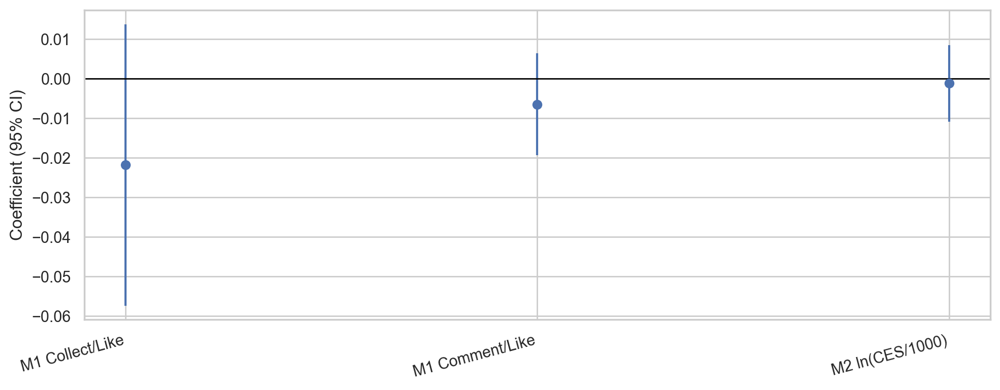
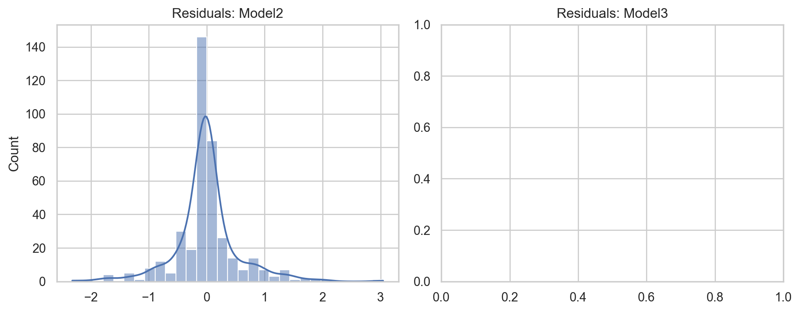

# 回归结果（固定效应 + 聚类稳健标准误）

数据来源：DMS001_enriched.csv

标准误：按 koc_id 聚类（cluster-robust）

## Model1_CollectRatio_FE

- N = 400, K = 1, Clusters = 40, df_t = 39, withinR2 = 0.005241

| term | coef | se(cluster) | t | p | |
|---|---:|---:|---:|---:|:--:|
| anxiety_score | -0.02178060 | 0.01817347 | -1.1985 | 0.237961 |  |

## Model1_CommentRatio_FE

- N = 400, K = 1, Clusters = 40, df_t = 39, withinR2 = 0.004358

| term | coef | se(cluster) | t | p | |
|---|---:|---:|---:|---:|:--:|
| anxiety_score | -0.00644741 | 0.00658849 | -0.9786 | 0.333816 |  |

## Model2_lnCESper1000_FE_Cat

- N = 400, K = 1, Clusters = 40, df_t = 39, withinR2 = 0.000195

| term | coef | se(cluster) | t | p | |
|---|---:|---:|---:|---:|:--:|
| anxiety_sq | -0.00116522 | 0.00494630 | -0.2356 | 0.814996 |  |

## Model3_lnQuote_FE

- N = 0, K = 0, Clusters = 0, df_t = 0, withinR2 = 
- Note: ln_note_quote 在每个 koc_id 内几乎没有变化，固定效应模型无法识别系数。

| term | coef | se(cluster) | t | p | |
|---|---:|---:|---:|---:|:--:|

